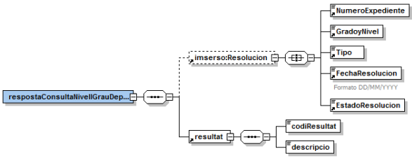

# Via Oberta – DEPENDèNCIA
Documentació d'integració del servei Dependència del Consorci AOC.

# **Índex** #

1. [Introducció]
2. [Transmissions de dades disponibles]
3. [Missatgeria del servei]
   1. [Consulta de nivell i grau de dependència (GRAU_DEPENDENCIA)]
      1. [Petició – dades genèriques]
      2. [Petició – dades específiques]
   2. [Joc de proves]

## 1 Introducció

Aquest document detalla la missatgeria associada al servei de consulta de nivell i grau de dependència.

Per a poder realitzar la integració cal conèixer prèviament la següent documentació:

<ul><li>Document de Missatgeria Genèrica de la PCI del Consorci AOC.</li></ul>

## 2 Transmissions de dades disponibles

Les dades disponibles a través del servei són les que es presenten a continuació:

- **EMISSOR**: IMSERSO (Instituto de Mayores y Servicios Sociales)

| **PRODUCTE** | **MODALITAT** | **DESCRIPCIO** |
| --- | --- | --- |
| **DEPENDENCIA** | GRAU_DEPENDENCIA | Consulta de nivell i grau de dependència.

Totes les consultes del producte tenen disponible la versió imprimible del resultat de la consulta en
format PDF. Per més detalls adreceu-vos a l’apartat Extensions de missatgeria del document de
missatgeria genèrica.

## 3 Missatgeria dels serveis

A continuació es detalla la missatgeria corresponent al bloc de dades específiques de les modalitats
de consum del producte.

```
L’emissor de les dades requereix que s’informin les dades del funcionari que realitza la
consulta. Així, cal informar l’element Funcionario del bloc de dades genèriques:
/Peticion/Funcionario i //SolicitudTransmision/DatosGenericos/Solicitante/Funcionario.
```
### 3.1 Consulta de nivell i grau de dependència

#### 3.1.1 Petició – dades genèriques

| _Element_ | _Descripció_ |
| --- | --- |
//DatosGenericos/Titular/TipoDocumentacion | Tipus de documentació (NIF, Pasaporte, NIE).

//DatosGenericos/Titular/Documentacion | Documentació.

#### 3.1.2 Resposta – dades específiques

<p align="center">

</p>

| _Element_ | _Descripció_ |
| --- | --- |
respostaConsultaNivellGrauDependencia/Resolucion | Bloc de dades corresponent a la informació sobre la resolució de dependència.

respostaConsultaNivellGrauDependencia/Resolucion/NumeroExpediente | Número d’expedient.

respostaConsultaNivellGrauDependencia/Resolucion/GradoyNivel | Camp que especifica el grau i nivell de dependència:<ul><li>Grado III Nivel 2</li><li>Grado III Nivel 1</li><li>Grado II Nivel 2</li><li>Grado II Nivel 1</li><li>Grado I Nivel 2</li><li>Grado I Nivel 1</li></ul>


respostaConsultaNivellGrauDependencia/Resolucion/Tipo | Tipus de dependència reconeguda:<ul><li>Grado y Nivel</li><li>Grado y Nivel (DF1)</li></ul></br></br>La diferència de Grado y Nivel (DF1) respecte a Grado y Nivel és que pels graus i nivells que encara no apliquen, degut a la progressivitat que marca la Llei, no se’ls resol el grau i nivell com a tal sinó que se li aplica la Disposició Final Primera de manera que se li reconeix la seva dependència però no se pot seguir gestionant les prestacions donat que el seu grau encara no ha entrat en vigor.

respostaConsultaNivellGrauDependencia/Resolucion/FechaResolucion | Data en que se li reconeix el grau i nivell de dependència al titular consultat.

respostaConsultaNivellGrauDependencia/Resolucion/EstadoResolucion | Especifica l’estat de la resolució:<ul><li>Firmada</li> <li>Recurrida: la resolució ha estat prèviament signada, és vigent però el recurs o revisió encara no ha estat resolt.</li> <li>En tramite</li></ul>


respostaConsultaNivellGrauDependencia/resultat/codiResultat | Codi de resultat:<ul><li>0000 : reconegut grau i nivell.</li><li>0001 : reconegut grau i nivell (DF1).</li>
<li>0002 : reconeixement en tràmit.</li><li>0233 : no consta informació per aquest titular.</li><li>0502 : error realitzant la consulta.</li></ul>

respostaConsultaNivellGrauDependencia/resultat/descripcio | Descripció del resultat.

## 4 Joc de proves

L’emissor final de les dades proporciona les següents dades vàlides per l’entorn de pre-producció:

| _Tipus_ | _Documentació_ | _Grau i nivell_ | _Tipus_ | _Data resolució_ | _Estat_ |
| --- | --- | --- | --- | --- | --- |

NIF | 23362162G | Grado II Nivel 2 | Reconocido Grado y nivel | 06/04/2010 | Firmada
NIF | 8217183L | Grado III Nivel 2 | Reconocido Grado y nivel | 06/07/2010 | Recurrida
NIF | 8214853N | | Reconocimiento en trámite| | 
NIF | 8217571Q | Grado III Nivel 2 vReconocido Grado y nivel | 17/03/2011 | Firmada
NIF | 80078671P | Grado I Nivel 2 | Reconocido Grado y nivel | 27/10/2011 | Firmada
NIF | 76259751P | Grado III Nivel 2 | Reconocido Grado y nivel | 02/03/2011 | Firmada
NIF | 08209236F | Grado III Nivel 2 vReconocido Grado y nivel | 27/10/2011 | Firmada
NIE | X2819703H | Grado III Nivel 2 | Reconocido Grado y nivel | 12/03/2012 | Firmada
NIE | X5771569H | Grado III Nivel 2 vReconocido Grado y nivel | 12/03/2012 | Firmada
Pasaporte | A4508244702 | Grado III Nivel 2 | Reconocido Grado y nivel | 12/03/2012 | Firmada
Pasaporte | A4512182100 | Grado III Nivel 2 vReconocido Grado y nivel | 12/03/2012 | Firmada
NIF | 33916710J | Grado I Nivel 2 vReconocido Grado y nivel (DF1) | 01/01/2009 | Firmada
NIF | 35269874H | Grado I Nivel 2 | Reconocido Grado y nivel (DF1) | 28/04/2010 | Firmada
NIF | 24078125T | Grado I Nivel 2 | Reconocido Grado y nivel (DF1) | 29/04/2010 | Firmada
NIF | 23428734Z | Grado I Nivel 2 | Reconocido Grado y nivel (DF1) | 29/04/2010 | Firmada
